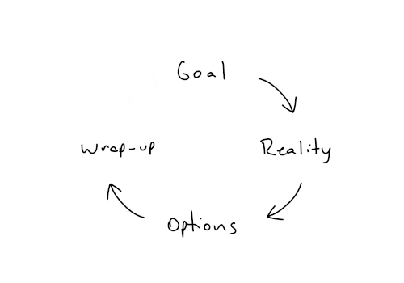

# Learn how to coach

_Something nice here_

> The content below is primarily from [The Tao of Coaching](https://www.amazon.com/Tao-Coaching-Effectiveness-Inspiring-Developing/dp/1781253323).

It is not about you. It's about the coachee.

Don't rely on assumptions. Ask a lot of questions.

Learn to be comfortable with awkward silences. Resist the urge to fill every blank space with words.

At the end of each session, ask yourself: Did I help them think today? If the answer is yes, congrats! You had a good session.

Help them have a more accurate assessment of their skills. It is hard to improve when you are in the [unconscious incompetence stage of competence](https://en.wikipedia.org/wiki/Four_stages_of_competence).

Help them become independent.

## The GROW Model

A simple four-step structure for coaching sessions.

1. **Goal**. Agree on the goal of the discussion.
2. **Reality**. Assess reality. Share specific examples.
3. **Options**. What could be done? What will be done?
4. **Wrap up**. Commit to action, define a time frame, and identify possible obstacles

Goal
* Agree on a topic for discussion
* Agree on a specific objective
* Set long-term aim if appropriate

Reality
* Invite self-assessment
* Offer specific examples of feedback
* Avoid or check assumptions
* Discard irrelevant history

Options
* Cover the full range of options
* Invite suggestions from the coachee
* Offer suggestions carefully
* Ensure choices are made

Wrap-up
* Commit to action
* Identify possible obstacles
* Make steps specific and define timing
* Agree on support

## Selecting an appropriate coaching style with the skill will matrix (link)

## Sample GROW questions

**Goal**
* What is it you would like to discuss?
* What would you like to achieve?
* What would you like from this session?
* What would need to happen for you to walk away feeling that this time was well spent?
* If I could grant you a wish for this session, what would it be?
* What would you like to be different when you leave this session?
* What would you like to happen that is not happening now
* What would you like not to happen that is happening now?
* What outcome would you like from this session/discussion/interaction?
* Is that realistic?
* Can we do that in the time we have available?
* Will that be of real value to you?

**Reality**
* What is happening at the moment?
* How do you know that this is accurate?
* When does this happen?
* How often does this happen? Be precise if possible.
* What effect does this have?
* How have you verified, or would you verify, that it is so?
* What other factors are relevant?
* Who else is relevant?
* What is their perception of the situation?
* What have you tried so far?

**Options**
* What could you do to change the situation?
* What alternatives are there to that approach?
* Tell me what possibilities for action you see. Don't worry about whether they are realistic at this stage.
* What approach/actions have you seen used, or used, yourself, in similar circumstances?
* Who might be able to help?
* Would you like suggestions from me?
* Which options do you like the most?
* What are the benefits and pitfalls of these options?
* Which options are of interest to you?
* Rate from 1-10 the practicality of each of these options.
* Rate from 1-10 the interest level of each of these options.
* Would you like to choose an option to act on?

**Wrap up**
* What are the next steps?
* Precisely when will you take them?
* What might get in the way?
* Do you need to log the steps in your diary?
* What support do you need?
* If needed, how and when will you ask for help?
