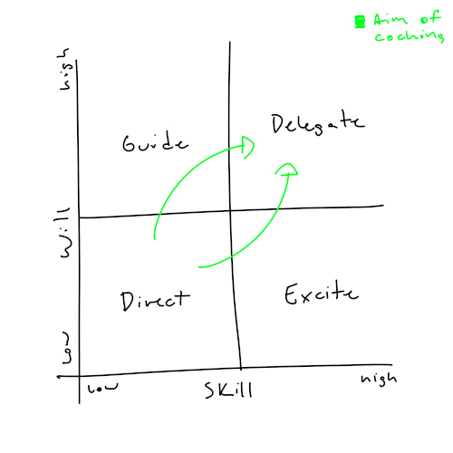

# Adapt your style

<!--
I might add an unconventional addition: Nudge. Sometimes you are dealing
with a person so senior that you simply have to check in and give them very
subtle pushes in a slightly different direction. Perhaps this is an exteme case
of Delegate.
 -->
_Something nice here_

Make this more generic so it can work for individual contributors and Managers

1. For the task, diagnose the coachee's skill and will levels
    * Skill depends on experience, training, understanding, role perception
    * Will depends on the desire to achieve, incentives, security, and confidence
2. Identify the appropriate style (Direct, Guide, Excite, Delegate)
3. Agree your intended approach with your coachee

Ensure you are addressing the coachee's skill and will to execute specific tasks - for example, "answering questions about past mistakes" rather than "improve communication."

**Direct** (skill and will are both low)
* First, build the will
  * Provide clear briefing
  * Identify motivations
  * Develop a vision of future performance
* Then build the skill
  * Structure tasks for quick wins
  * Coach and train
* Then sustain the will
  * Provide frequent feedback
  * Praise and nurture
* Supervise closely with tight control and clear rules/deadlines

**Guide** (low skill, high will)
* Invest time early on
   * Coach and train
   * Answer questions/explain
* Create a risk-free environment to allow early mistakes and learning
* Relax control as progress is shown

**Excite** (high skill, low will)
* Identity reason for the low will
* Motivate
* Monitor, feedback

**Delegate** (skill and will are both high)
* Provide freedom to do the job
  * Set objective, not the method
  * Praise. Don't ignore this!
* Encourage coachee to take responsibility
  * Involve in decision making
  * Use "You tell me what you think"
* Take appropriate risk
  * Give more stretching tasks
  * Don't over-manage

