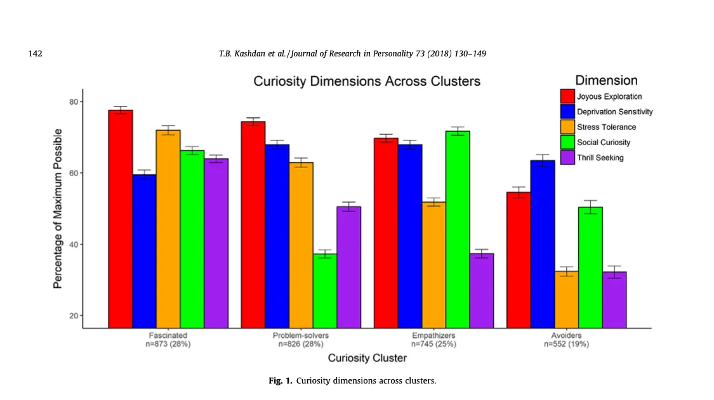

# Be curious

<!--
Perhaps suggest here that you should have interests that are outside of
your company, current job and perhaps your current career.
 -->
_Something nice here_

<!-- Hook -->
<!-- Tool -->
<!-- Evidence -->
<!-- Story -->
<!-- Recap -->

> “[...] consistently acting on curious feelings serves to expand knowledge, build intellectual and creative capacities, and strengthen social relationships” [1]

> “A curious person is responsive to organizational changes; they are more intrigued than frustrated when trying to understand, appreciate, and extract the unique value of new colleagues and technologies, and flexible enough to adapt strategies and plans to unfamiliar cultures in sophisticated global markets” [1]

Paper 1 - The Five-Dimensional Curiosity Scale: Capturing the bandwidth of curiosity and identifying four unique subgroups of curious people

This model breaks from the traditional curious-to-incurious scale and allows us to have a more nuanced conversation about different types, and drivers, of curiosity.

As you can see on the image above, they used five dimensions of curiosity:

* Joyous Exploration - what we typically associate curiosity with

* Deprivation Sensitivity - for example, when you can’t relax until you remember the name of that movie with that actor

* Stress tolerance - ability to cope with the uncertain, the ambiguous, and the new

* Social Curiosity - dealing with interpersonal relationships

* Thrill Seeking - dealing with risky or dangerous situations to get to new experiences

They also defined four subgroups of curious people:

* Fascinated
* Problem-solvers
* Empathizers
* Avoiders

> “[This model] was developed to document the fact that human beings have different ways of experiencing and expressing curiosity. These differences are relevant to how people represent things in their minds, and why they are motivated to seek out new information and experiences, discover, learn, and grow.” [2]

Paper 2 - Curiosity has comprehensive benefits in the workplace: Developing and validating a multidimensional workplace curiosity scale in United States and German employees

This model used four dimensions:

* Joyous Exploration
* Deprivation Sensitivity
* Stress Tolerance
* Openness to People’s Ideas

> “For a person to be curious they must believe there is sufficient novelty potential and believe they can cope with or manage this novelty” [1]

> “People who scored high on Stress Tolerance and Openness to People’s Ideas in the United States and Germany endorsed well-being at work and a high frequency of innovative behaviors, Joyous Exploration was uniquely predictive of these outcomes in Germany, but not the United States.” [1]

> “The results in the current set of studies, in the United States and Germany, offer nuances to prior work by showing that Stress Tolerance and Openness to People’s Ideas appear to be the curiosity dimensions most relevant to workplace satisfaction, engagement, social relationships, and performance.” [1]

I imagine that increasing Stress Tolerance is the most actionable path to increase curiosity at work. Could the tools that we use to build Psychological safety also be applied to increase Stress Tolerance?

What kind of curious person are you? How about your team?

Would it make sense to make an effort to increase your curiosity (of your team’s)?

[1] [Curiosity has comprehensive benefits in the workplace: Developing and validating a multidimensional workplace curiosity scale in United States and German employees](https://www.researchgate.net/publication/337444010_Curiosity_has_comprehensive_benefits_in_the_workplace_Developing_and_validating_a_multidimensional_workplace_curiosity_scale_in_United_States_and_German_employees)

[2] [The Five-Dimensional Curiosity Scale: Capturing the bandwidth of curiosity and identifying four unique subgroups of curious people](https://www.researchgate.net/publication/321471978_The_Five-Dimensional_Curiosity_Scale_Capturing_the_bandwidth_of_curiosity_and_identifying_four_unique_subgroups_of_curious_people)
